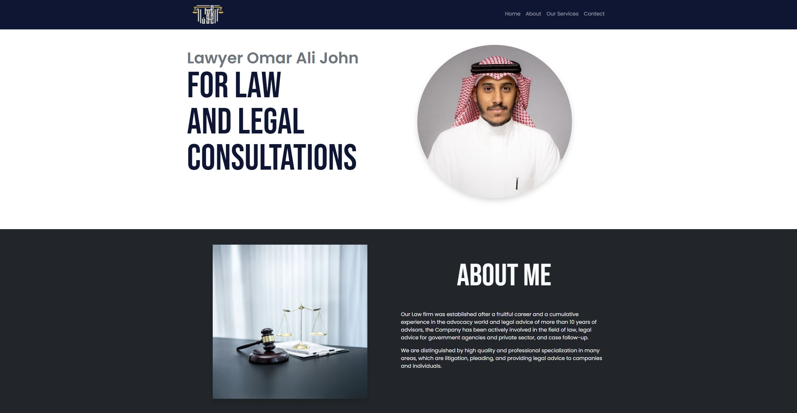

# [Omar Ali John Legal Counsel & Advocacy]

This project aims to create a professional and user-friendly online portfolio for [Friend's Name], an experienced attorney specializing in [Friend's Area of Law]. The portfolio will serve as a digital showcase of their legal expertise, experience, and client testimonials.

## Features

* React
* Bootstrap
* Sass

## Demo

[wibesite](https://zippy-swan-9b0623.netlify.app/)

## Usage

## Author(s) (Optional)

* [Mohammed Khaled] ([Mohammed-M97](https://github.com/Mohammed-M97))